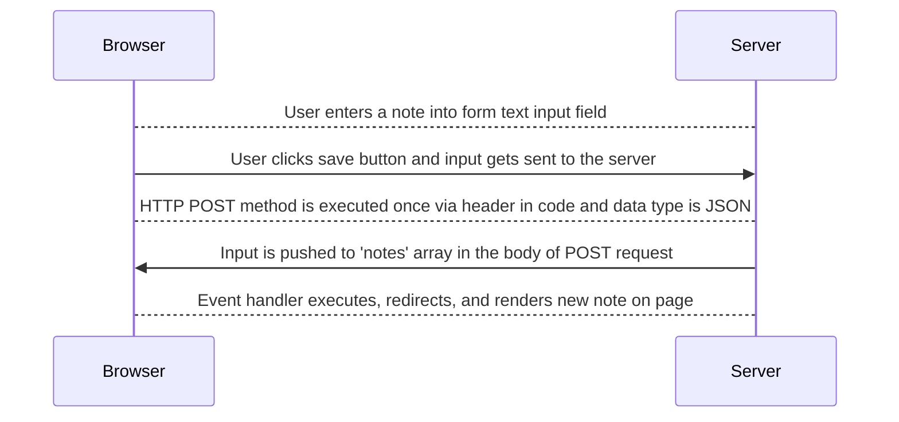

```mermaid
   sequenceDiagram
        Browser-->Server: User enters a note into form text input field
        Browser->>Server: User clicks save button and input gets sent to the server 
        Server-->Browser: HTTP POST method is executed once via header in code and data type is JSON
        Server->>Browser: Input is pushed to 'notes' array in the body of POST request
        Browser-->Server: Event handler executes, redirects, and renders new note on page
   
```